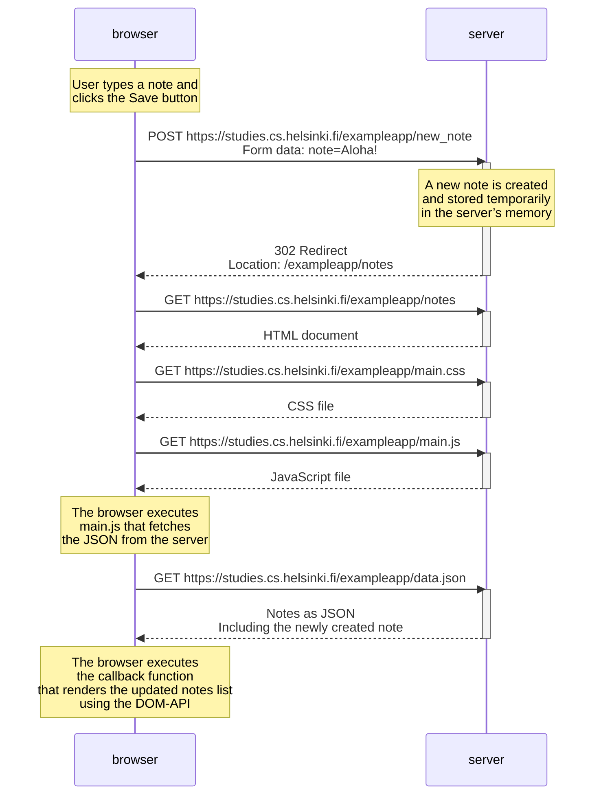

```mermaid
sequenceDiagram
    participant browser
    participant server

    Note over browser: User types a note and<br/>clicks the Save button

    browser->>server: POST https://studies.cs.helsinki.fi/exampleapp/new_note<br/>Form data: note=Aloha!
    activate server

    Note over server: A new note is created<br/>and stored temporarily<br/>in the server’s memory

    server-->>browser: 302 Redirect<br/>Location: /exampleapp/notes
    deactivate server

    browser->>server: GET https://studies.cs.helsinki.fi/exampleapp/notes
    activate server
    server-->>browser: HTML document
    deactivate server

    browser->>server: GET https://studies.cs.helsinki.fi/exampleapp/main.css
    activate server
    server-->>browser: CSS file
    deactivate server

    browser->>server: GET https://studies.cs.helsinki.fi/exampleapp/main.js
    activate server
    server-->>browser: JavaScript file
    deactivate server

    Note over browser: The browser executes<br/>main.js that fetches<br/>the JSON from the server

    browser->>server: GET https://studies.cs.helsinki.fi/exampleapp/data.json
    activate server
    server-->>browser: Notes as JSON<br/>Including the newly created note
    deactivate server

    Note over browser: The browser executes<br/>the callback function<br/>that renders the updated notes list<br/>using the DOM-API
```