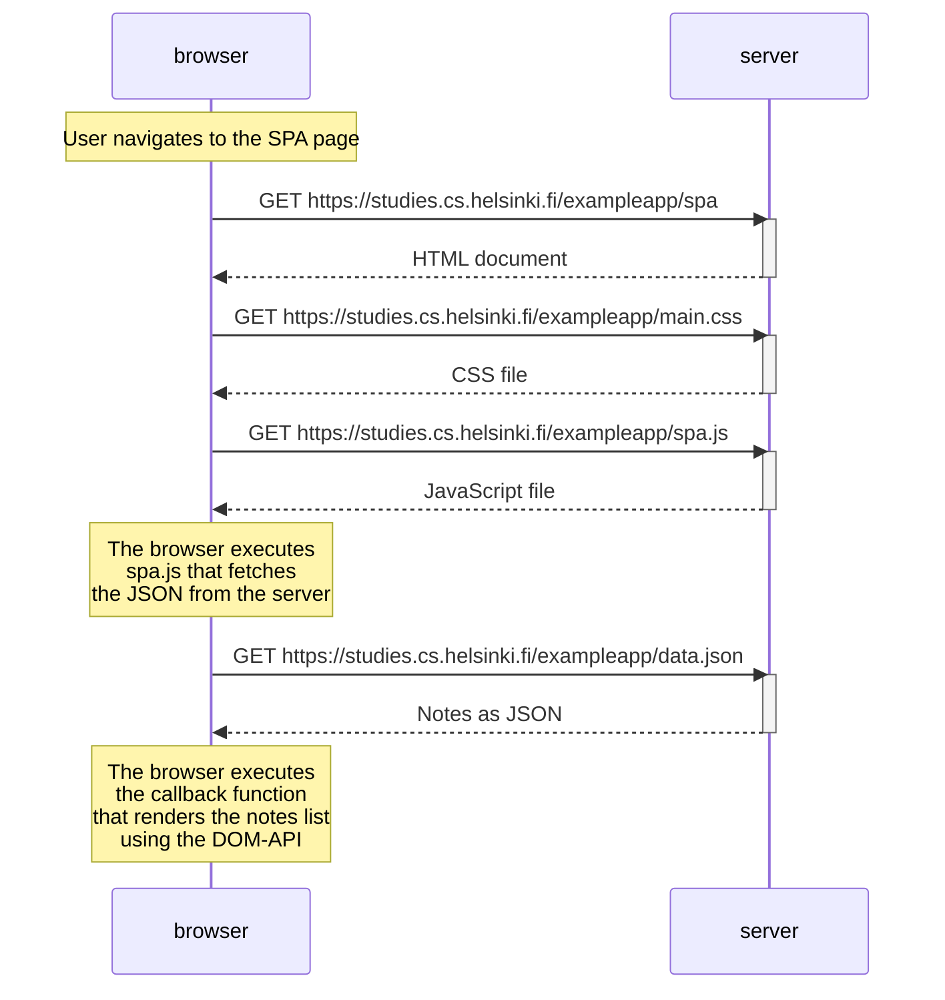

```mermaid
sequenceDiagram
    participant browser
    participant server

    Note over browser: User navigates to the SPA page

    browser->>server: GET https://studies.cs.helsinki.fi/exampleapp/spa
    activate server
    server-->>browser: HTML document
    deactivate server

    browser->>server: GET https://studies.cs.helsinki.fi/exampleapp/main.css
    activate server
    server-->>browser: CSS file
    deactivate server

    browser->>server: GET https://studies.cs.helsinki.fi/exampleapp/spa.js
    activate server
    server-->>browser: JavaScript file
    deactivate server

    Note over browser: The browser executes<br/>spa.js that fetches<br/>the JSON from the server

    browser->>server: GET https://studies.cs.helsinki.fi/exampleapp/data.json
    activate server
    server-->>browser: Notes as JSON
    deactivate server

    Note over browser: The browser executes<br/>the callback function<br/>that renders the notes list<br/>using the DOM-API
```