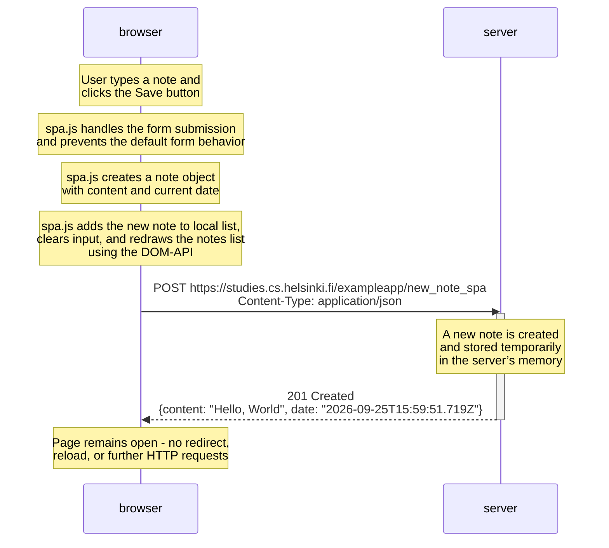

```mermaid
sequenceDiagram
    participant browser
    participant server

    Note over browser: User types a note and<br/>clicks the Save button

    Note over browser: spa.js handles the form submission<br/>and prevents the default form behavior

    Note over browser: spa.js creates a note object<br/>with content and current date

    Note over browser: spa.js adds the new note to local list,<br/>clears input, and redraws the notes list<br/>using the DOM-API

    browser->>server: POST https://studies.cs.helsinki.fi/exampleapp/new_note_spa<br/>Content-Type: application/json
    activate server

    Note over server: A new note is created<br/>and stored temporarily<br/>in the server’s memory

    server-->>browser: 201 Created<br/>{content: "Hello, World", date: "2026-09-25T15:59:51.719Z"}
    deactivate server

    Note over browser: Page remains open - no redirect,<br/>reload, or further HTTP requests
```